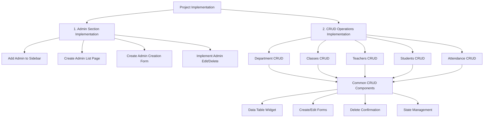

# Implementation Plan: Admin Section and CRUD Operations

## Overview
This plan outlines the implementation of an admin section and CRUD operations for the QR Code Attendance System's admin side.

## Implementation Flow



## Detailed Implementation Steps

### 1. Admin Section Implementation

#### Directory Structure
```
lib/
  features/
    admin/
      data/
        models/
          admin_model.dart
        repositories/
          admin_repository.dart
      presentation/
        pages/
          admin_page.dart
          create_admin_page.dart
          edit_admin_page.dart
        widgets/
          admin_list.dart
          admin_form.dart
      providers/
        admin_provider.dart
```

#### Components
1. **Sidebar Navigation**
   - Add admin icon and label
   - Update navigation provider

2. **Admin List Page**
   - Data table showing admin details:
     * Name
     * Phone
     * Access Level
     * Creation Date
   - Actions column for edit/delete
   - Create new admin button

3. **Admin Creation Form**
   - Fields:
     * First Name
     * Last Name
     * Phone
     * Access Level (super/limited)
   - Form validation
   - Success/error handling

4. **Edit/Delete Functionality**
   - Edit form with pre-filled data
   - Delete confirmation dialog
   - Success/error feedback

### 2. Data Layer Setup

1. **Data Models**
   - Create entity models matching database schema
   - Implement toJson/fromJson methods
   - Add validation methods

2. **Supabase Integration**
   - Configure Supabase client
   - Create repository classes
   - Implement error handling
   - Add loading state management

### 3. CRUD Operations by Section

#### a. Department Management
1. **List View**
   - Data table with departments
   - Sorting and filtering
   - Pagination support

2. **Create/Edit**
   - Department form:
     * Name
     * Code
   - Validation
   - Success/error handling

3. **Delete**
   - Confirmation dialog
   - Dependency checking

#### b. Classes Management
1. **List View**
   - Data table with class details
   - Department filter
   - Search functionality

2. **Create/Edit**
   - Class form:
     * Department selection
     * Academic year
     * Current year
     * Section
     * Name

3. **Delete**
   - Confirmation dialog
   - Check for enrolled students

#### c. Teachers Management
1. **List View**
   - Data table with teacher details
   - Department filter
   - Search by name/ID

2. **Create Form**
   - Registration style form:
     * Personal details
     * Department assignment
     * Employee ID
   - Form validation

3. **Edit/Delete**
   - Update teacher information
   - Handle course assignments

#### d. Students Management
1. **List View**
   - Data table with student details
   - Class/group filter
   - Search functionality

2. **Create Form**
   - Registration style form:
     * Personal details
     * Student number
     * Class/group assignment
   - Form validation

3. **Edit/Delete**
   - Update student information
   - Handle attendance records

#### e. Attendance Management
1. **List View**
   - Data table with attendance records
   - Multiple filters:
     * Date range
     * Course
     * Student
     * Status
   - Export functionality

2. **Create/Edit**
   - Attendance form
   - Status update
   - Bulk operations

### 4. Common Components Development

1. **Data Table Widget**
   - Sorting capabilities
   - Filtering system
   - Pagination
   - Selection controls
   - Action buttons

2. **Form Components**
   - Input fields
   - Dropdown selects
   - Date/time pickers
   - Validation display
   - Submit/cancel buttons

3. **Dialog Components**
   - Confirmation dialogs
   - Error dialogs
   - Loading indicators

4. **Feedback Components**
   - Success/error snackbars
   - Loading overlays
   - Error displays

### 5. State Management

1. **Provider Setup**
   - Feature-specific providers
   - Global state providers
   - Loading state management
   - Error state handling

2. **State Organization**
   - Clear state interfaces
   - Immutable state updates
   - State persistence where needed

## Implementation Order

1. Common Components
2. Admin Section
3. Department CRUD
4. Classes CRUD
5. Teachers CRUD
6. Students CRUD
7. Attendance CRUD

## Next Steps
1. Switch to Code mode to begin implementing the common components
2. Start with the admin section implementation
3. Progressively implement CRUD operations for each section