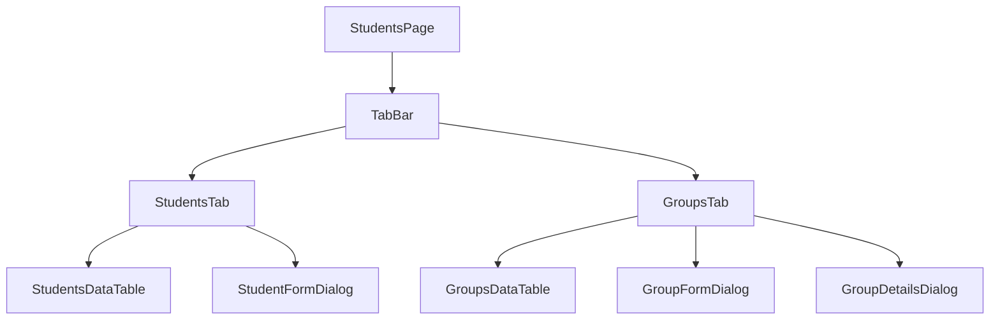

# Student Groups Management Implementation Plan

## Overview
Implementation of group management functionality as a tab within the students page, providing a comprehensive interface for managing student groups and their assignments.

## Component Structure


## 1. Data Layer

### Group Model
```dart
class GroupModel {
  final String id;
  final String departmentId;
  final int academicYear;
  final int currentYear;
  final String section;
  final String? name;
  final DateTime createdAt;
  final DateTime updatedAt;
}
```

### Repository Methods
```dart
class GroupRepository {
  Future<List<GroupModel>> getAllGroups();
  Future<GroupModel> createGroup();
  Future<GroupModel> updateGroup();
  Future<void> deleteGroup();
  Future<List<StudentModel>> getGroupStudents();
  Future<void> assignStudentsToGroup();
  Future<void> removeStudentsFromGroup();
}
```

## 2. State Management

### Group Provider
```dart
class GroupNotifier extends StateNotifier<AsyncValue<List<GroupModel>>> {
  Future<void> loadGroups();
  Future<void> createGroup();
  Future<void> updateGroup();
  Future<void> deleteGroup();
  Future<void> assignStudents();
  Future<void> removeStudents();
}
```

## 3. UI Components

### Students Tab Enhancements
- Add group filter dropdown
- Add batch group assignment functionality
- Show group information in student table

### Groups Tab Features
1. Groups Data Table
   - Display all groups with:
     - Department name
     - Academic year
     - Current year
     - Section
     - Student count
     - Actions (edit/delete)

2. Group Form Dialog
   - Department selection
   - Academic year input
   - Current year input
   - Section input
   - Name input (optional)

3. Group Details Dialog
   - Group information
   - List of assigned students
   - Student assignment management
   - Group statistics

## 4. Implementation Steps

1. Data Layer
   - Create `group_model.dart`
   - Create `group_repository.dart`
   - Implement Supabase CRUD operations
   - Add student-group relationship methods

2. State Management
   - Create `group_provider.dart`
   - Implement state and operations
   - Handle loading and error states

3. UI Layer
   - Update `students_page.dart` with TabBar
   - Create `groups_tab.dart`
   - Create `group_form.dart`
   - Create `group_details.dart`
   - Add group filter to students tab

## 5. File Structure
```
lib/
  features/
    students/
      data/
        models/
          group_model.dart
        repositories/
          group_repository.dart
      presentation/
        pages/
          students_page.dart
        widgets/
          groups_tab.dart
          group_form.dart
          group_details.dart
          group_filter.dart
      providers/
        group_provider.dart
```

## 6. Additional Features
- Group statistics dashboard
- Batch operations for student assignments
- Export group data
- Filter and search capabilities
- Department-based group organization

## 7. Dependencies
- Existing student management functionality
- Department data for group creation
- DataTableWidget for consistent UI