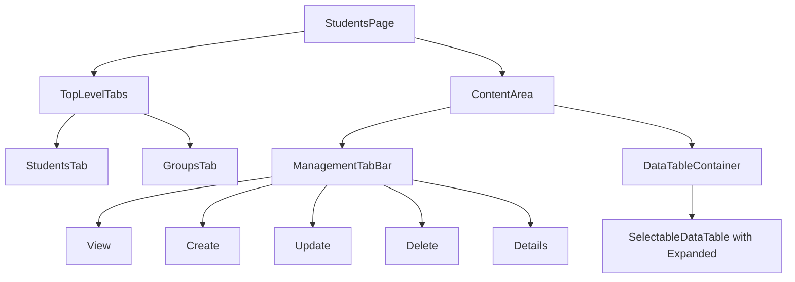
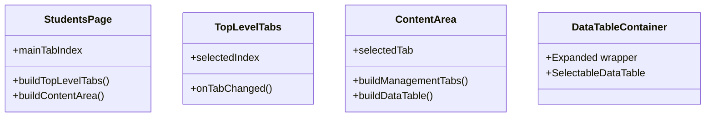

# Student Page Layout Implementation Plan

## Overview
Implementation of a new layout structure for the students page that includes:
1. Top-level tabs for switching between Students and Groups
2. Management tabs (create, delete, update, details) for each section
3. Expanded table area that takes up remaining space

## Layout Structure



## Component Hierarchy



## Implementation Steps

1. **Update Layout Structure**
   - Modify `students_page.dart` to include:
     - Top-level tab bar for Students/Groups switching
     - Flex layout with Expanded widget for table area
     - Management tabs below top-level tabs

2. **Tab Management**
   - Use existing `mainTabIndexProvider` for top-level tabs
   - Keep current `ManagementTab` enum and providers for sub-tabs
   - Ensure proper state management between tab switches

3. **Table Layout**
   - Wrap `SelectableDataTable` with Expanded widget
   - Update table styling for proper spacing
   - Ensure scrolling behavior works correctly

4. **UI Enhancements**
   - Add visual separation between tab sections
   - Implement proper padding and margins
   - Ensure responsive behavior

## Files to Modify

```
lib/features/students/
├── presentation/
│   ├── pages/
│   │   └── students_page.dart       # Main layout updates
│   └── widgets/
│       ├── management_tab_view.dart # Update tab bar layout
│       └── selectable_data_table.dart # Add Expanded wrapper
└── providers/
    └── tab_provider.dart           # Already handles tab state
```

## Implementation Details

1. **Layout Container**
   - Use Column widget as main container
   - Top-level tabs at the top
   - Management tabs below
   - Expanded widget for table area
   - Proper spacing between sections

2. **State Management**
   - Keep existing tab state providers
   - Add necessary UI update logic for tab switches
   - Maintain selection state during tab changes

3. **Table Configuration**
   - Configure table to properly expand
   - Handle overflow with scrolling
   - Maintain column proportions

4. **Styling**
   - Consistent padding and margins
   - Visual hierarchy through spacing
   - Clear tab selection indicators