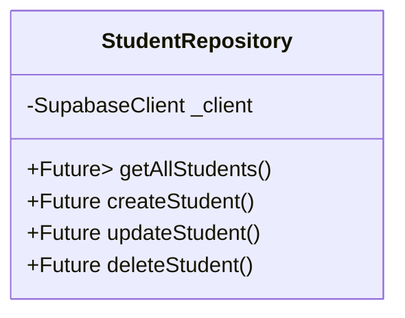
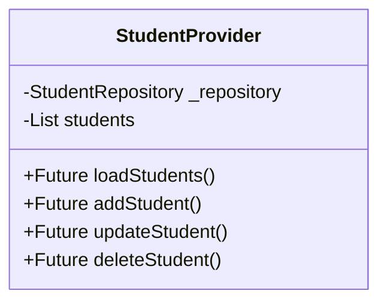
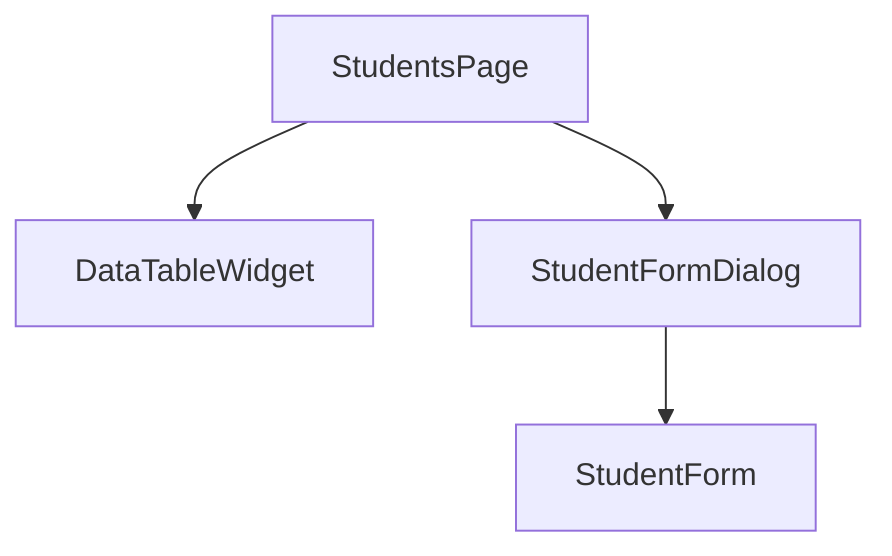

# Student CRUD Implementation Plan

## 1. Data Layer

### Student Model
```dart
class StudentModel {
  final String id;
  final String firstName;
  final String lastName;
  final String? phone;
  final String studentNumber;
  final String? groupId;
  final DateTime createdAt;
  final DateTime updatedAt;
  
  // Constructor, copyWith, fromJson, toJson methods
}
```

### Repository Structure


## 2. Business Logic Layer

### Student Provider


## 3. Presentation Layer

### Components Hierarchy


### Implementation Steps:

1. **Data Layer**
   - Create `student_model.dart`
   - Create `student_repository.dart`
   - Implement CRUD operations using Supabase client

2. **Business Logic**
   - Create `student_provider.dart`
   - Implement state management for students list
   - Handle CRUD operations through repository

3. **Presentation**
   - Update `students_page.dart`
   - Create `student_form.dart`
   - Create `student_form_dialog.dart`
   - Reuse common widgets (DataTableWidget, etc.)

4. **Features**
   - Display students list in a data table
   - Add new student with form dialog
   - Edit existing student information
   - Delete student with confirmation
   - Filter and search capabilities
   - Group assignment functionality

## File Structure:
```
lib/
  features/
    students/
      data/
        models/
          student_model.dart
        repositories/
          student_repository.dart
      presentation/
        pages/
          students_page.dart
        widgets/
          student_form.dart
          student_form_dialog.dart
      providers/
        student_provider.dart