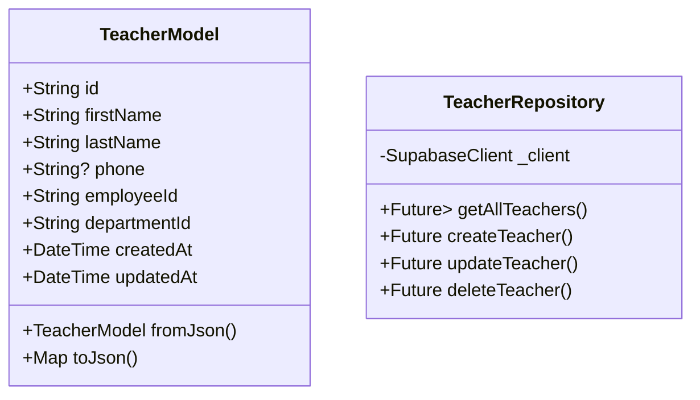
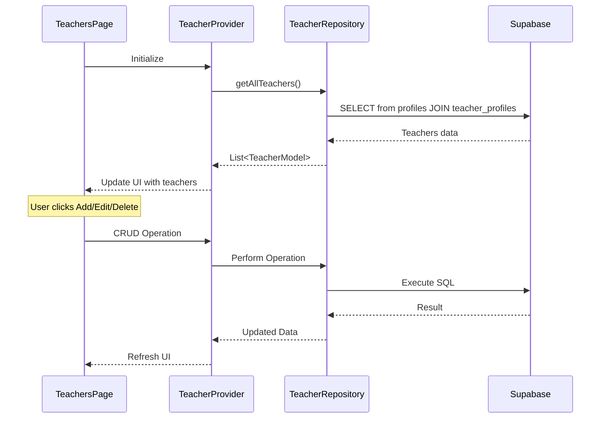

# Teachers CRUD Implementation Plan

## Overview
This document outlines the plan for implementing CRUD (Create, Read, Update, Delete) operations for managing teachers in the QR Code Attendance System.

## Data Layer

### Teacher Model

## UI Flow

### Sequence Diagram

## Implementation Steps

1. Create Teacher Model:
   - Create `TeacherModel` class with all necessary fields
   - Implement `fromJson` and `toJson` methods
   - Add model validation

2. Create Teacher Repository:
   - Implement CRUD operations following admin repository pattern
   - Handle proper joins between profiles and teacher_profiles tables
   - Implement error handling and cleanup

3. Create Teacher Provider:
   - Use Riverpod for state management
   - Handle loading, error, and success states
   - Cache teacher data and provide CRUD methods

4. Update Teachers Page:
   - Use `DataTableWidget` for displaying teachers
   - Define columns: Name, Employee ID, Department, Phone, Actions
   - Implement sorting and filtering
   - Add floating action button for creating new teachers

5. Create Teacher Form:
   - Form for adding/editing teachers
   - Fields: First Name, Last Name, Email, Phone, Employee ID, Department
   - Form validation
   - Department dropdown selector

6. Add Dialog Confirmations:
   - Delete confirmation dialog
   - Success/Error feedback dialogs

## Architectural Principles

- Clean separation of concerns (data, business logic, UI)
- Consistent error handling and data validation
- Reuse of existing components (DataTableWidget)
- Follow existing patterns from admin implementation
- Type safety and null safety